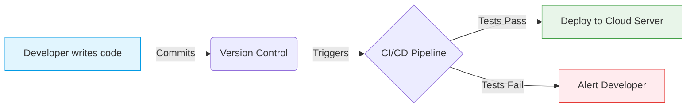
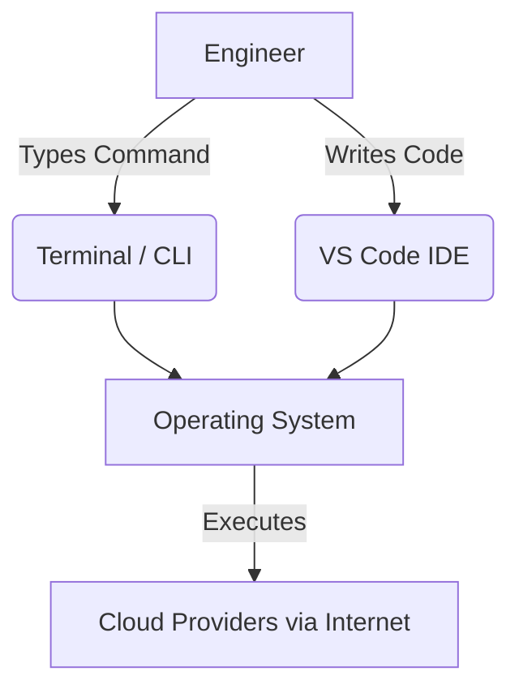

# نقطه صفر و تصویر کلان

در این مسیر آموزشی، هدف انتقال مفاهیم بر پایه روش تفکر اصول اولیه (`First Principles Thinking`) است؛ به این معنا که تمامی موضوعات تا پایین‌ترین سطح شکافته شده و مجدداً بازسازی می‌شوند تا درک عمیقی از سیستم‌ها حاصل گردد و نیازی به کپی-پیست کدهای آماده نباشد.

## نقشه راه دوره

سفر آموزشی از مبانی پایه آغاز شده و به سطح معماری سیستم‌های بزرگ ختم می‌گردد:

۱. **ماژول ۱ (`Pre-Flight`):** درک معماری کلان، نحوه ارتباط اجزا و تسلط بر سیستم کنترل نسخه (`Git`).

۲. **ماژول ۲ (`Terraform`):** یادگیری `Infrastructure as Code` برای ساخت شبکه‌ها و سرورها صرفاً با نوشتن کد، مدیریت `State` و کار تیمی.

۳. **ماژول ۳ (`CI/CD Pipelines`):** ساخت سیستم‌های اتوماسیون برای تست، بیلد و استقرار کدها (نظیر `GitHub Actions`).

۴. **ماژول ۴ (`Advanced GitOps & SRE`):** پیاده‌سازی متدولوژی `GitOps`، مدیریت کلاسترهای `Kubernetes` و مانیتورینگ متریک‌های قابلیت اطمینان سیستم.

**هدف نهایی:**
طراحی و پیاده‌سازی یک زیرساخت ابری کامل و امن از طریق کدهای `Terraform`، ایجاد پایپ‌لاین‌های اتوماتیک `CI/CD` و استقرار نرم‌افزارها بدون دخالت دست و با کمترین میزان قطعی (`Downtime`) در محیط `Production`.

---

## ۰.۱. سرور، فضای ابری و `DevOps`

در این بخش با مفاهیم بنیادین کامپیوترهای همیشه روشن، اجاره منابع پردازشی و فرهنگ ترکیب توسعه و عملیات آشنا می‌شویم تا زبان مشترک مهندسی زیرساخت شکل بگیرد.

### تاریخچه و چرایی پیدایش

در گذشته (دهه ۲۰۰۰ میلادی)، برای راه‌اندازی یک وب‌سایت نیاز به خرید سخت‌افزار فیزیکی (`Server`) با هزینه‌های بالا بود. این سرورها در اتاق‌های خنک (`Datacenter`) نصب می‌شدند و در صورت افزایش ترافیک، ارتقای آن‌ها هفته‌ها زمان می‌برد.

علاوه بر این، برنامه‌نویس‌ها (`Developers`) کد را توسعه داده و به تیم عملیات (`Operations`) برای اجرا تحویل می‌دادند. در صورت بروز خطا، برنامه‌نویس مدعی کارکرد کد روی سیستم محلی بود و تیم عملیات نقص را از سمت کد می‌دانست. این دیوار بی‌اعتمادی منجر به کُندی شدید در انتشار نرم‌افزارها می‌شد.

**راه‌حل:** فناوری `Cloud` توسعه یافت تا سرورها در چند ثانیه قابل اجاره باشند و فرهنگ `DevOps` ایجاد شد تا مانع ارتباطی بین تیم‌های توسعه و عملیات برداشته شود.

### مفاهیم پایه و تشبیه دنیای واقعی

- **سرور (`Server`):** یک کامپیوتر قدرتمند فاقد مانیتور و کیبورد که همواره روشن بوده و برای پاسخ به درخواست‌های کاربران به اینترنت پرسرعت متصل است (مشابه آشپزخانه‌ای که بی‌وقفه در حال آماده‌سازی سفارشات است).
- **فضای ابری (`Cloud`):** استفاده از زیرساخت‌های شرکت‌های ارائه‌دهنده (نظیر `Amazon` یا `Google`) بر اساس میزان مصرف. مشابه اجاره یک اتاق در هتل به جای ساخت یک خانه کامل؛ در اینجا منابع پردازشی به صورت ساعتی یا ثانیه‌ای اجاره می‌شوند.
- **توسعه و عملیات (`DevOps`):** فرآیندی مشابه خط تولید پیشرفته. تیم‌های توسعه و عملیات به جای کار در انزوا، سیستمی اتوماتیک (`CI/CD`) می‌سازند که تغییرات را دریافت کرده، تست می‌کند و به صورت خودکار در محیط نهایی مستقر می‌سازد.



### فرهنگ لغات تخصصی

- **زیرساخت محلی (`On-Premise`):** زیرساخت فیزیکی که درون ساختمان و توسط خود سازمان نصب و نگهداری می‌شود (نقطه مقابل `Cloud`).
- **دیتاسنتر (`Datacenter`):** مرکز داده متشکل از رک‌های سرور، تجهیزات شبکه، سیستم‌های خنک‌کننده و ژنراتورهای برق.
- **سیلو (`Silo`):** تیم‌هایی که در انزوا کار کرده و اطلاعات یا فرآیندهای خود را با دیگر بخش‌ها به اشتراک نمی‌گذارند (مانع اصلی پیاده‌سازی فرهنگ `DevOps`).

### کارگاه عملی: کالبدشکافی کد

برای برقراری ارتباط اولیه با یک سرور در اینترنت، از ابزار `ping` استفاده می‌شود که عملکردی شبیه به "در زدن" دارد.

```bash
# Sending 4 packets of data to Google's server
ping -c 4 google.com
```

**تحلیل خط به خط:**

- `ping`: برنامه‌ای که یک بسته داده (`Packet`) را به مقصد ارسال کرده و منتظر پاسخ می‌ماند.
- `-c 4`: پارامتر یا پرچمی (`Flag`) که به برنامه دستور می‌دهد عملیات را دقیقاً ۴ بار تکرار کند (`Count = 4`).
- `google.com`: آدرس مقصدی که درخواست به سمت آن ارسال می‌شود.

### نکات `SRE` و بهترین روش‌ها

> 💡 **نکته حرفه‌ای:** در معماری مدرن ابری، سرورها به عنوان موجودیت‌های بی‌همتا و غیرقابل تعویض (`Pet`) در نظر گرفته نمی‌شوند که در صورت خرابی زمان زیادی صرف تعمیرشان شود. در این معماری، سرورها مانند واحدهای قابل جایگزین (`Cattle`) هستند؛ اگر یکی از آن‌ها دچار مشکل شود، به سرعت از بین رفته و یک سرور جدید جایگزین آن می‌گردد. این الگوی معماری به نام `Pet vs Cattle` شناخته می‌شود.

### چالش مهندسی آشوب

**سناریو:** پس از اجرای دستور `ping` به سمت یک سرور، خطای زیر در خروجی نمایان می‌شود:

```bash
ping: cannot resolve myawesomeserver.local: Unknown host
```

**رویکرد عیب‌یابی در `SRE`:**
مواجهه با خطا نیازمند تحلیل دقیق متن ارور (`Error Log`) است. در این سناریو، کلمه `resolve` نشان می‌دهد که مشکل از قطعی کابل یا خاموش بودن سرور نیست، بلکه سیستم‌عامل نمی‌تواند نام سرور را در سیستم نام دامنه (`DNS`) اینترنت پیدا کند.

---

## ۰.۲. آماده‌سازی سیستم مهندسی

سیستم توسعه‌دهنده به عنوان کابین خلبان در مدیریت زیرساخت عمل می‌کند. در این بخش، نصب ابزارهای استاندارد صنعت برای نگارش کدهای زیرساخت بررسی می‌گردد.

### تاریخچه و چرایی استفاده از ابزارهای خط فرمان

در گذشته، نصب نرم‌افزارها نیازمند مراجعه به وب‌سایت‌ها، دانلود فایل‌های اجرایی و طی کردن رابط‌های گرافیکی (`ClickOps`) بود. در صورت بروز مشکل سیستمی، پیکربندی مجدد ابزارها ساعت‌ها زمان می‌برد.
امروزه در مهندسی `DevOps`، به جای استفاده از رابط‌های گرافیکی، از مدیر بسته‌ها (`Package Manager`) در محیط متنی استفاده می‌شود تا فرآیند نصب با یک خط دستور به صورت خودکار انجام گیرد.

### مفاهیم پایه سیستم‌های توسعه

- **خط فرمان (`Terminal` / `CLI`):** راهی برای ارتباط مستقیم، سریع و بدون واسطه با هسته سیستم‌عامل به جای استفاده از رابط کاربری گرافیکی (`GUI`).
- **محیط توسعه (`IDE`):** نرم‌افزاری یکپارچه (نظیر `VS Code`) برای نوشتن کدها، ساختاردهی فایل‌ها و یافتن خطاها.



### فرهنگ لغات تخصصی ابزارها

- **رابط `CLI`:** مخفف `Command Line Interface`، محیطی که دستورات به صورت متنی در آن وارد می‌شوند.
- **رابط `GUI`:** مخفف `Graphical User Interface`، محیط کاربری گرافیکی مجهز به پنجره‌ها و نشانگر ماوس.
- **مدیریت بسته (`Package Manager`):** مخزنی برای نصب برنامه‌ها از طریق ترمینال (مانند `brew` در مک، `apt` در لینوکس و `choco` در ویندوز).

### کارگاه عملی: نصب ابزارها

برای نصب `Terraform` در سیستم‌عامل `macOS` با استفاده از ابزار `Homebrew`، فرآیند زیر اجرا می‌شود:

```bash
# Update the package index and install terraform
brew update
brew install hashicorp/tap/terraform
```

**تحلیل خط به خط:**

- `brew update`: به‌روزرسانی لیست مخازن بسته‌ها برای دریافت آخرین نسخه‌ها.
- `brew install`: فرمان دریافت و نصب نرم‌افزار.
- `hashicorp/tap/terraform`: مسیر دقیق بسته؛ شامل نام شرکت (`hashicorp`)، مخزن اختصاصی (`tap`) و نام ابزار (`terraform`).

> ⚠️ **هشدار امنیتی/عملیاتی:** کدهای کپی‌شده از منابع اینترنتی نباید به طور مستقیم در ترمینال جای‌گذاری (`Paste`) شوند. جهت جلوگیری از اجرای کدهای مخفی و مخرب، پیشنهاد می‌شود کدهای کپی‌شده ابتدا در یک ویرایشگر متن ساده بررسی گردند.

### چالش مهندسی آشوب در نصب

**سناریو:** پس از اتمام نصب، جهت بررسی نسخه نرم‌افزار دستور `terraform --version` وارد می‌شود، اما سیستم‌عامل خطای زیر را صادر می‌کند:

```bash
bash: terraform: command not found
```

**رویکرد عیب‌یابی در `SRE`:**
صدور این خطا به معنای عدم شناسایی دستور توسط سیستم‌عامل است. این مشکل عموماً ناشی از خطای نصبی نبوده، بلکه نشان‌دهنده آن است که مسیر فایل اجرایی برنامه در متغیرهای محیطی سیستم (`Environment Variable PATH`) تعریف نشده است.
