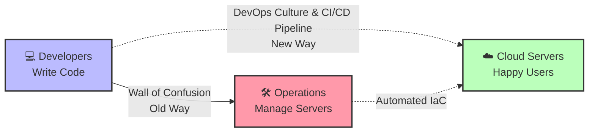

ورود به حوزه مهندسی زیرساخت نیازمند درک عمیق از مفاهیم پایه و اکوسیستم ابزارها است. پیش از آغاز پیاده‌سازی عملی، درک معماری کلی و آماده‌سازی سیستم محلی (Local Machine) به عنوان محیط توسعه الزامی است.

## ۰.۱. مفهوم سرور، رایانش ابری و فرهنگ DevOps

### تاریخچه و چرایی پیدایش

در ساختارهای سنتی توسعه نرم‌افزار، همواره مانعی شناخته‌شده تحت عنوان «دیوار سردرگمی» (Wall of Confusion) میان تیم‌های توسعه (Development) و عملیات (Operations) وجود داشت. تیم‌های توسعه بر تولید کدهای جدید و اعمال سریع تغییرات تمرکز داشتند، در حالی که هدف اصلی تیم‌های عملیات، حفظ پایداری سیستم و جلوگیری از استقرارهای پرخطر بود.
فرهنگ و تکنولوژی DevOps (ترکیب Development و Operations) به منظور از بین بردن این فاصله، ایجاد یکپارچگی و خودکارسازی فرآیندها شکل گرفت.

### مفاهیم کلیدی زیرساخت

- **سرور (Server):** یک رایانه قدرتمند (اغلب بدون رابط کاربری گرافیکی و نمایشگر) است که در مراکز داده مستقر شده و به صورت پیوسته برای پردازش و پاسخ‌گویی به درخواست‌های شبکه فعالیت می‌کند.
- **رایانش ابری (Cloud Computing):** رویکردی است که در آن به جای تهیه و نگهداری سرورهای فیزیکی اختصاصی، منابع پردازشی به صورت ابری و بر اساس میزان مصرف (Pay-as-you-go) از ارائه‌دهندگانی مانند AWS یا GCP اجاره می‌شوند.
- **فرهنگ DevOps:** یک چارچوب ساختاری و فرهنگی است که با استفاده از فرآیندهای خودکار (نظیر خطوط لوله CI/CD)، اطمینان حاصل می‌کند که کدهای نوشته‌شده به شکلی سریع، امن و پایدار به محیط نهایی (Production) منتقل شوند.



## ۰.۲. آماده‌سازی محیط توسعه (Local Environment)

برای مدیریت بهینه زیرساخت‌های ابری، سیستم محلی باید به ابزارهای استاندارد صنعتی مجهز شود. در رویکردهای نوین مهندسی، به جای مدیریت منابع از طریق رابط کاربری (ClickOps)، تمامی پیکربندی‌ها از طریق خط فرمان (Terminal/CLI) و به صورت کد انجام می‌پذیرد. ترمینال، مسیر ارتباطی مستقیم با هسته سیستم‌عامل است.

### گام‌های نصب ابزارهای پایه

۱. **محیط توسعه (VS Code):**
این نرم‌افزار به عنوان ویرایشگر اصلی برای توسعه کدهای زیرساخت (مانند فایل‌های Terraform و پیکربندی‌های YAML) مورد استفاده قرار می‌گیرد.
برای نصب، به وب‌سایت `code.visualstudio.com` مراجعه و نسخه متناسب با سیستم‌عامل دریافت شود.

۲. **سیستم کنترل نسخه (Git):**
گیت ابزاری برای مدیریت و پیگیری تغییرات کد (Version Control) است. در سیستم‌عامل ویندوز، نصب این نرم‌افزار محیط متنی قدرتمندی به نام Git Bash را نیز فراهم می‌کند.
فایل نصبی در وب‌سایت `git-scm.com` در دسترس است.

۳. **رابط خط فرمان (Terraform CLI):**
این ابزار وظیفه ترجمه کدهای زیرساخت به منابع واقعی در ارائه‌دهندگان ابری را بر عهده دارد.
جهت نصب، به آدرس `developer.hashicorp.com/terraform/install` مراجعه گردد.

۴. **پلتفرم کانتینر (Docker Desktop):**
داکر بستری فراهم می‌کند تا برنامه‌ها در محیط‌های ایزوله (کانتینر) بسته‌بندی شوند، به گونه‌ای که عملکرد آن‌ها مستقل از سیستم‌عامل میزبان، همواره پایدار و یکسان باشد.
برای دریافت این نرم‌افزار، از لینک `docs.docker.com/get-docker` استفاده شود.

### مدیریت بسته‌ها از طریق خط فرمان

در استانداردهای حرفه‌ای مهندسی، نصب نرم‌افزارها عموماً به کمک مدیر بسته‌ها (Package Managers) و از طریق خط فرمان انجام می‌شود. به عنوان مثال، در محیط macOS از ابزار Homebrew، در لینوکس از `apt` یا `yum` و در ویندوز از `choco` یا `winget` استفاده می‌گردد:

```bash
brew install terraform
```

> **نکته مهم:** مواجهه با خطاها در محیط ترمینال، بخشی طبیعی از فرآیند توسعه و مهندسی زیرساخت است. این پیام‌های خطا راهنمای دقیقی برای عیب‌یابی (Troubleshooting) سیستم محسوب می‌شوند و بررسی لاگ‌ها یک مهارت ضروری است.
