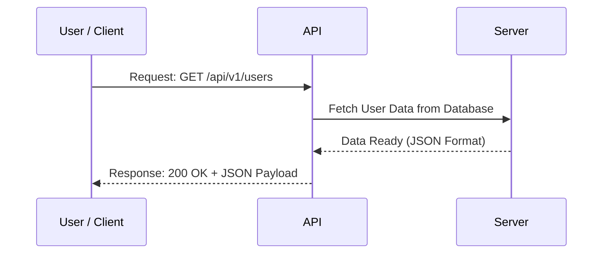

# اصطلاحات پایه و زبان مشترک سیستم‌ها

در این بخش، مفاهیم اساسی و زبان مشترکی که سیستم‌های مدرن برای برقراری ارتباط استفاده می‌کنند، بررسی می‌شود. درک نحوه گفتگوی ماشین‌ها با یکدیگر و فرمت‌های انتقال پیام، پیش‌نیاز ورود به دنیای زیرساخت و معماری ابری است.

## تاریخچه و دلایل تکامل معماری‌ها

در گذشته، سیستم‌های نرم‌افزاری غالباً با معماری یکپارچه و غول‌پیکر (`Monolithic`) طراحی می‌شدند. برای برقراری ارتباط بین دو سیستم مجزا (مثلاً سیستم حسابداری و سیستم انبارداری)، مهندسان باید فایل‌های متنی بسیار پیچیده‌ای را تولید کرده و به صورت دستی یا زمان‌بندی‌شده بین سرورها منتقل می‌کردند.

فایل‌های پیکربندی (`Configuration Files`) در این سیستم‌ها معمولاً با زبان‌هایی مانند `XML` نوشته می‌شد که خوانایی پایینی برای انسان داشت و فاقد استانداردی ساده و جهانی برای تبادل سریع داده‌ها بود.

**راه‌حل مدرن:**
با گذار به معماری‌های توزیع‌شده (مانند میکروسرویس‌ها)، سیستم‌ها به قطعات کوچکتر تقسیم شدند. در این راستا، رابط‌های برنامه‌نویسی نرم‌افزار (`API`) شکل گرفتند تا برنامه‌ها بتوانند در لحظه با یکدیگر تبادل اطلاعات کنند. همزمان، برای ساده‌سازی خواندن و نوشتن فایل‌های پیکربندی توسط انسان و ماشین، فرمت‌های داده‌ای بهینه‌تری نظیر `JSON`، `YAML` و در نهایت `HCL` معرفی شدند.

## مفاهیم پایه و تمثیل دنیای واقعی

برای درک بهتر مکانیزم‌های ارتباطی، می‌توان از تمثیل‌های روزمره استفاده کرد:

### مفهوم API

رابط `API` مخفف `Application Programming Interface` است.
به عنوان یک تمثیل، محیط یک رستوران را در نظر بگیرید:

- **مشتری (`Client`):** درخواست‌کننده سرویس.
- **آشپزخانه (`Server`):** پردازش‌کننده و تأمین‌کننده سرویس.
- **گارسون (`API`):** رابطی که درخواست را از مشتری می‌گیرد، به آشپزخانه می‌برد و نتیجه (غذای آماده یا `Data`) را برمی‌گرداند.

مشتری نیازی به دانستن جزئیات پخت غذا یا فرآیندهای داخلی آشپزخانه ندارد؛ صرفاً درخواست استاندارد خود را ارسال کرده و پاسخ را دریافت می‌کند.

### مفهوم Webhook

برخلاف `API` که کلاینت برای آگاهی از وضعیت یک فرآیند باید به صورت دوره‌ای درخواست ارسال کند (`Polling`)، مکانیزم `Webhook` مبتنی بر رویداد (`Event-driven`) عمل می‌کند.
در همان تمثیل رستوران، `Webhook` مانند دستگاه پیجر (`Pager`) کوچکی است که هنگام ثبت سفارش به مشتری داده می‌شود. مشتری می‌تواند به کارهای دیگر خود بپردازد و به محض آماده شدن سفارش، پیجر به صدا درمی‌آید و سیستم به صورت خودکار تغییر وضعیت را اطلاع‌رسانی می‌کند.

### فرمت‌های داده (JSON / YAML / HCL)

این موارد زبان‌های برنامه‌نویسی نیستند، بلکه روش‌هایی استاندارد برای سریال‌سازی داده‌ها (`Data Serialization`) محسوب می‌شوند. هدف از طراحی آن‌ها، ایجاد ساختاری است که هم برای ماشین به سادگی قابل پردازش باشد و هم چشم انسان به راحتی بتواند مقادیر را بخواند.



## فرهنگ لغات تخصصی (Jargon Buster)

- **نقطه پایانی (`Endpoint`):**
  آدرس دقیق و مشخصی در شبکه اینترنت یا اینترانت که برای برقراری ارتباط با یک سرویس یا `API` خاص استفاده می‌شود (معادل شماره یک میز مشخص در رستوران).

- **محموله (`Payload`):**
  داده‌های واقعی، مفید و اصلی که در بدنه یک درخواست (`Request`) یا پاسخ (`Response`) بین ماشین‌ها رد و بدل می‌شود.

- **سینتکس (`Syntax`):**
  قوانین نگارشی و ساختاری یک زبان یا فرمت داده (مانند محل قرارگیری پرانتزها، کاماها یا میزان تو‌رفتگی‌ها).

## کارگاه عملی و کالبدشکافی کد

در ادامه، تفاوت نحوه تعریف یک ماشین مجازی ساده در سه فرمت رایج بررسی می‌شود تا ساختار و سینتکس هر کدام مشخص گردد.

### ساختار اول: فرمت JSON

این فرمت رایج‌ترین استاندارد در تبادل اطلاعات از طریق `API`ها است.

```json
{
  "server": {
    "name": "web-server-01",
    "port": 8080,
    "active": true
  }
}
```

**کالبدشکافی خط‌به‌خط:**

- نمادهای `{` و `}`: نشان‌دهنده شروع و پایان یک شیء (`Object`) داده‌ای هستند. این بلوک‌بندی برای پردازش ماشینی بسیار ایده‌آل است.
- `"server":`: یک کلید (`Key`) است که باید حتماً درون جفت‌گیومه یا دابل‌کوتیشن (`"`) قرار گیرد.
- `"name": "web-server-01",`: مقادیر متنی نیز داخل کوتیشن قرار می‌گیرند و هر جفت کلید-مقدار باید با علامت کاما (`,`) از خط بعدی جدا شود.

### ساختار دوم: فرمت YAML

این فرمت به دلیل خوانایی بالا، استاندارد اصلی در ابزارهای `CI/CD` و پلتفرم‌هایی مانند `Kubernetes` است.

```yaml
server:
  name: "web-server-01"
  port: 8080
  active: true
```

**کالبدشکافی خط‌به‌خط:**

- `server:`: در این فرمت نیازی به استفاده از آکولاد یا کوتیشن پیرامون کلیدها نیست و ساختار کاملاً برای انسان بهینه شده است.
- `  name:`: وجود دقیقاً دو فاصله (`Space`) قبل از کلمه، مشخص می‌کند که این کلید، زیرمجموعه (فرزند) کلید بالایی خود یعنی `server` است.

### ساختار سوم: فرمت HCL

فرمت `HCL` زبان پیکربندی اختصاصی شرکت `HashiCorp` است که به طور گسترده در ابزار `Terraform` استفاده می‌شود.

```hcl
resource "aws_instance" "web" {
  ami           = "ami-12345"
  instance_type = "t2.micro"
}
```

**کالبدشکافی خط‌به‌خط:**

- `resource`: کلمه‌ای کلیدی در `Terraform` که نشان‌دهنده درخواست ایجاد یک زیرساخت جدید است.
- `"aws_instance"`: نوع منبع مورد نظر (در این مثال، یک ماشین مجازی ابری در `AWS`).
- `"web"`: یک شناسه دلخواه و محلی که توسط طراح برای ارجاع به این سرور در داخل کد انتخاب شده است.
- `=`: در این فرمت، بر خلاف دو مورد قبل، برای تخصیص مقدار از علامت مساوی استفاده می‌شود که به خوانایی آن کمک شایانی می‌کند.

## نکات حرفه‌ای SRE و بهترین روش‌ها

**نکته حیاتی تو‌رفتگی‌ها (`Indentation`):**
در نوشتن فایل‌های `YAML`، بزرگترین چالش مهندسان `DevOps` مسئله فاصله‌گذاری است. توصیه می‌شود در ویرایشگر کد (مانند `VS Code`) تنظیمات مربوطه به گونه‌ای اعمال شود که فشردن کلید `Tab` به صورت خودکار به فاصله (معمولاً ۲ عدد `Space`) تبدیل گردد.
استفاده از کلید `Tab` واقعی در فایل‌های `YAML` منجر به بروز خطاهای مهلک (`Syntax Error`) می‌شود و یک فاصله اشتباه می‌تواند مانع از استقرار و اجرای صحیح سرویس در محیط عملیاتی (`Production`) گردد. پارسرهای ماشینی در زمینه قوانین سینتکس کاملاً سخت‌گیر هستند.

## چالش مهندسی آشوب

**سناریو:**
فرض کنید مهندسی در حال نوشتن اولین فایل پیکربندی پایپ‌لاین `CI/CD` خود با فرمت `YAML` است. پس از ارسال کد به سرور، پایپ‌لاین متوقف شده و خطای زیر در لاگ‌ها (`Logs`) ثبت می‌شود:

```text
Error parsing YAML file: mapping values are not allowed in this context at line 4, column 12
```

محتوای فایل ارسالی به شکل زیر بوده است:

```yaml
pipeline:
  stages:
    - build
    - test:
        timeout: 10m
```

**تحلیل وضعیت و نحوه تفکر SRE:**
دلیل بروز این خطا در خط ۴ است. در سینتکس `YAML`، عناصری که با خط تیره (`-`) آغاز می‌شوند نمایانگر یک آرایه یا لیست (`List`) هستند. زمانی که یک کلید (مانند `test:`) بلافاصله پس از خط تیره قرار می‌گیرد و سپس تلاش می‌شود در زیرمجموعه آن مقداری مانند `timeout` تعریف شود، ماشین در تشخیص نوع داده (اینکه آیا این یک عنصر متنی ساده در لیست است یا یک شیء دارای زیرمجموعه) دچار سردرگمی می‌شود (`mapping values are not allowed`). برای رفع این مشکل، باید ساختار تورفتگی‌ها اصلاح شده یا از روش صحیح ترکیب دیکشنری‌ها درون لیست‌ها استفاده شود.
